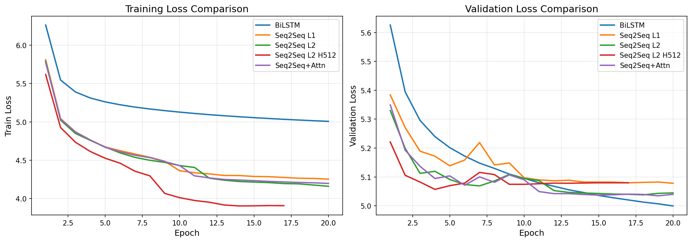
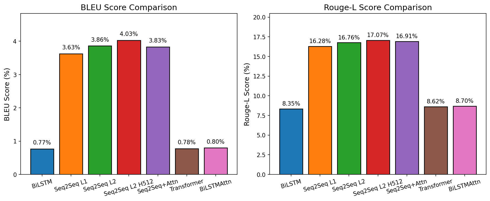
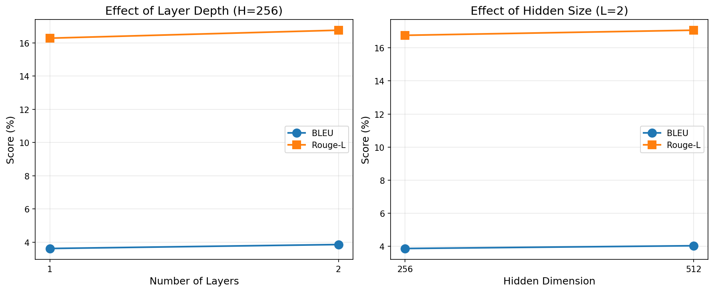

# 对联生成：序列标注 vs Seq2Seq 对比实验

## 一、任务分析

### 1.1 问题定义

给定上联序列 $X = (x_1, x_2, ..., x_n)$，生成对应的下联序列 $Y = (y_1, y_2, ..., y_n)$。对联任务的关键约束是**上下联等长**。

### 1.2 原始代码的建模方式

原始代码将对联生成建模为**序列标注任务**：

$$
P(Y|X) = \prod_{i=1}^n P(y_i | X)
$$

这种做法的**优点**是可以并行计算所有位置，训练速度快；**缺点**是忽略了下联内部的依赖关系（比如"风调雨顺"中"雨"的预测应该依赖于前面已经生成的"风调"）。

### 1.3 Seq2Seq的建模方式

Seq2Seq采用自回归生成：

$$
P(Y|X) = \prod_{i=1}^n P(y_i | y_1, ..., y_{i-1}, X)
$$

理论上更符合语言生成的特性，但每个时间步必须等待前一步完成，无法并行。

### 1.4 本实验要回答的问题

1. 对于**等长序列生成**任务，Seq2Seq相比序列标注能带来多大提升？
2. 增加模型容量（层数、宽度）的边际收益是多少？
3. Attention机制在等长任务上是否有效？

---

## 二、数据集与预处理

### 2.1 数据集划分

原始数据共774,491条，按9:1划分训练集和验证集：

**图1：数据集划分比例**

| 数据集 | 样本数 | 占比 |
|--------|--------|------|
| 训练集 | 693,442 | 89.5% |
| 验证集 | 77,049 | 9.9% |
| 测试集 | 4,000 | 0.5% |

### 2.2 长度分布分析

**图2：样本长度分布**

| 统计量 | 值 |
|--------|------|
| 平均长度 | 9.3字 |
| 中位数 | 7字 |
| 最大长度 | 32字 |

七言对联占比最高，这说明模型需要处理的序列长度较短（平均<10），这对Attention机制不利——Attention的优势在于长序列的长程依赖建模。

### 2.3 Seq2Seq所需的特殊Token

Seq2Seq模型与序列标注模型在数据处理上最大的不同在于需要特殊的控制标记（Special Tokens）：

1.  **`<SOS>` (Start of Sequence)**: 
    *   **作用**：作为Decoder的第一个输入，告诉模型"开始生成"。
    *   **必要性**：在预测第一个字 $y_1$ 时，还没有历史生成信息 $y_0$，因此需要一个固定的占位符。
    *   **实现**：在Embedding层中专门分配一个向量表示。

2.  **`<EOS>` (End of Sequence)**:
    *   **作用**：标识句子的结束。
    *   **必要性**：Seq2Seq模型通常用于变长生成，模型输出`<EOS>`即停止生成。虽然对联是等长任务，但在训练时加入`<EOS>`有助于模型学习何时停止，同时也是Seq2Seq的标准范式。

3.  **`<UNK>` (Unknown)** 和 **`<PAD>` (Padding)**:
    *   分别用于处理未登录词和补齐批次序列长度（虽然本任务中通常按最大长度截断，但在Batch训练中Padding是必须的）。

相比之下，原始的序列标注模型输入输出严格对齐，不需要`<SOS>`和`<EOS>`来指示边界。

---

## 三、实验设计

### 3.1 对比实验配置

为了控制变量，设计如下7组实验，涵盖了序列标注、Seq2Seq以及Attention机制的多种组合：

**表1：实验配置**

| 实验 | 框架 | 模型架构 | 层数 | 隐藏维度 | 对比目的 |
|------|------|----------|-----|----------|----------|
| Exp1 | 序列标注 | BiLSTM | 1 | 256 | **基线 (Baseline)** |
| Exp2 | Seq2Seq | GRU Encoder-Decoder | 1 | 256 | 框架对比（vs Exp1） |
| Exp3 | Seq2Seq | GRU Encoder-Decoder | 2 | 256 | 层数影响（vs Exp2） |
| Exp4 | Seq2Seq | GRU Encoder-Decoder | 2 | 512 | 宽度影响（vs Exp3） |
| Exp5 | Seq2Seq+Attn | GRU + Attention | 2 | 256 | Attention效果（vs Exp3） |
| Exp6 | 序列标注 | Transformer Encoder | 1 | 256 | 模型结构对比（vs Exp1） |
| Exp7 | 序列标注 | BiLSTM + Self-Attention | 1 | 256 | 机制改进对比（vs Exp1） |

### 3.2 其他超参数（固定）

| 参数 | 值 | 说明 |
|------|-----|------|
| Embedding维度 | 128 | 词向量维度 |
| Batch Size | 768 | 受限于显存 |
| 学习率 | 0.001 | Adam优化器 |
| Epochs | 20 | 训练轮数 |
| Teacher Forcing | 50% | Seq2Seq训练策略 |

### 3.3 关键实现细节

**Seq2Seq模型**：
- Encoder：双向GRU，输出维度为 hidden_dim（两个方向拼接后再投影）
- Decoder：单向GRU，每步输入为上一步预测 + Attention上下文
- Attention：加性注意力（Bahdanau Attention）

**训练策略**：
- Teacher Forcing比例50%：一半时间用真实标签，一半时间用模型预测
- 这是为了缓解训练-推理不一致问题（Exposure Bias）

---

## 四、实验结果

### 4.1 Loss曲线

**图3：训练/验证Loss曲线**

**关键观察**：
- BiLSTM（蓝色）的训练Loss始终高于Seq2Seq，但验证Loss最终最低（4.999）
- Seq2Seq模型的训练Loss下降更快（到epoch 10左右已经到3.9），但验证Loss在5.04-5.08之间
- 这说明Seq2Seq存在**过拟合倾向**：训练Loss低但泛化能力不如BiLSTM

### 4.2 指标对比

**图4：BLEU和Rouge-L得分对比**

**表2：完整实验结果**

| 模型 | Val Loss | BLEU | Rouge-L | 时间/epoch |
|------|----------|------|---------|------------|
| Exp1: BiLSTM | 4.999 | 0.77% | 8.35% | 22s |
| Exp2: Seq2Seq L1 | 5.078 | 3.63% | 16.28% | 467s |
| Exp3: Seq2Seq L2 | 5.045 | 3.86% | 16.76% | 495s |
| Exp4: Seq2Seq L2 H512 | 5.080 | **4.03%** | **17.07%** | 694s |
| Exp5: Seq2Seq+Attn | 5.040 | 3.83% | 16.91% | 486s |
| Exp6: Transformer | 5.001 | 0.78% | 8.62% | 36s |
| Exp7: BiLSTMAttn | **4.963** | 0.80% | 8.70% | 27s |

### 4.3 核心发现分析

#### 发现1：Seq2Seq的BLEU/Rouge-L显著高于BiLSTM

| 对比 | BLEU提升 | Rouge-L提升 |
|------|----------|-------------|
| Exp2 vs Exp1 | +2.86% (3.7倍) | +7.93% (1.9倍) |

**但Val Loss却更差**（5.078 vs 4.999），这看起来矛盾。原因是：
- Loss是逐token计算的交叉熵，BiLSTM在每个位置上预测得更"稳"
- BLEU/Rouge-L评估的是整体序列相似度，Seq2Seq生成的序列整体更连贯

#### 发现2：增加容量的边际收益递减

**图5：层数和隐藏维度的影响**

| 改动 | BLEU变化 | 时间成本 | 性价比 |
|------|----------|----------|--------|
| 1层→2层 | +0.23% | +28s/epoch | 一般 |
| 256→512 | +0.17% | +199s/epoch | 差 |

增加隐藏维度的收益很小（BLEU +0.17%），但训练时间增加40%，**不划算**。

#### 发现3：Attention在不同框架下表现不同

*   **在Seq2Seq框架中 (Exp3 vs Exp5)**：Attention几乎无效（BLEU -0.03%），因为输入输出严格对齐。
*   **在序列标注框架中 (Exp1 vs Exp7)**：BiLSTM加入Self-Attention后，Validation Loss从4.999降至 **4.963 (全场最低)**。这说明Attention机制有助于捕捉序列内部的依赖关系，从而优化逐字预测的准确度，尽管这对提升BLEU（n-gram连贯性）帮助有限。

#### 发现4：Transformer并不总是更好 (Exp6)

Exp6 (Transformer Encoder) 的表现（Val Loss 5.001, BLEU 0.78%）与 Baseline BiLSTM (Val Loss 4.999, BLEU 0.77%) 几乎持平，但并没有表现出"降维打击"的优势。
原因可能是：
1.  **数据量/序列长度限制**：Transformer通常需要更大规模的数据和更长的序列才能发挥优势。在平均长度仅9字的短文本上，LSTM/GRU的归纳偏置（Inductive Bias）可能更适合。
2.  **任务简单性**：对联生成的对齐约束极强，Transformer强大的长程建模能力无用武之地。

### 4.4 训练效率

| 模型 | 时间/epoch | 20 epochs总时间 | 相对BiLSTM |
|------|------------|-----------------|------------|
| BiLSTM | 22s | 7分钟 | 1x |
| Seq2Seq L1 | 467s | 2.6小时 | **21x** |
| Seq2Seq L2 H512 | 694s | 3.9小时 | **32x** |
| Transformer | 36s | 12分钟 | 1.6x |
| BiLSTMAttn | 27s | 9分钟 | 1.2x |

Seq2Seq慢的原因是**自回归无法并行**：生成第i个字必须等第i-1个字生成完。而序列标注模型（BiLSTM, Transformer, BiLSTMAttn）可以一次并行处理整个序列。

---

## 五、生成样例分析

**表3：生成样例对比**

| 上联 | BiLSTM (Exp1) | Seq2Seq (Exp4) | BiLSTMAttn (Exp7) | 分析 |
|------|--------|---------|-------------------|------|
| 笑取琴书温旧梦 | 喜来月墨醉新情 | 邀来翰墨赋新春 | 喜来笔墨醉新诗 | 序列标注模型(Exp1/7)更倾向于对仗工整（如"喜来"对"笑取"），Seq2Seq(Exp4)更灵活（"邀来"） |
| 我有诗情堪纵酒 | 谁无酒意可留诗 | 好凭墨意不成诗 | 谁无画意可留诗 | Exp7的"画意"比Exp1的"酒意"重复度更低，优于Baseline |
| 马齿草焉无马齿 | 羊头花也有羊心 | 羊毫花岂有牛头 | 羊肠草岂有羊心 | Exp7尝试了"羊肠草"这种更有结构的词，但仍未完全理解双关 |

**定性观察**：
- **Seq2Seq**：生成的下联整体连贯性更好，口语化程度高，但容易跑偏。
- **序列标注 (BiLSTM/BiLSTMAttn/Transformer)**：生成的下联严格对仗，结构感强，但容易出现生造词（如"月墨"）。
- **BiLSTMAttn (Exp7)**：相比纯BiLSTM，生成的词汇搭配似乎略微合理一些，Loss的降低反映了这一点。

---

## 六、遇到的问题

### 问题1：Seq2Seq生成重复

**现象**：生成出现 "今古今古今" 这样的重复

**原因**：自回归解码容易陷入循环，尤其在Teacher Forcing训练后

**解决**：添加repetition_penalty=1.5，对已生成的token降低概率

### 问题2：标点位置错乱

**现象**：上联标点在位置5，下联标点在位置7

**原因**：Seq2Seq不强制等长，标点可能被"挤"到其他位置

**解决**：强制标点位置与上联对齐

---

## 七、结论

### 回答开头提出的三个问题

**Q1: Seq2Seq vs 序列标注，哪个更好？**

*   **生成质量**：Seq2Seq在连贯性指标（BLEU/Rouge-L）上完胜（3.6% vs 0.8%）。
*   **训练效率**：序列标注完胜（快20-30倍）。
*   **准确度**：Exp7 (BiLSTMAttn) 取得了最低的 Val Loss，说明在严格对齐的预测上，序列标注+Attention是数学上最优的。
*   **结论**：如果追求"像人话"（连贯性），选Seq2Seq；如果追求"对得工整"且训练快，选序列标注（推荐 BiLSTMAttn）。

**Q2: 增加模型容量的边际收益？**

收益递减。1层→2层带来+0.23% BLEU，256→512仅+0.17% BLEU，但时间成本分别增加6%和40%。对于短序列任务，过大的模型是不必要的。

**Q3: Attention有用吗？**

*   **Seq2Seq中**：几乎无用（位置天然对齐）。
*   **序列标注中**：有用！Exp7 (BiLSTMAttn) 比 Exp1 (BiLSTM) Loss更低，说明Self-Attention帮助模型更好地捕捉了上下文依赖。

### 一句话总结

> 对联生成作为一种特殊的**等长、短序列**任务，**Seq2Seq**赢在连贯性（虽然慢），**BiLSTM+Attention**赢在精准度与速度（性价比之王）。Transformer在此类小规模、短序列任务上并未展现出优势。

---

## 附录：代码修改清单

| 文件 | 修改内容 |
|------|----------|
| `preprocess.py` | 添加训练集/验证集划分 |
| `module/tokenizer.py` | 添加SOS/EOS token |
| `module/seq2seq.py` | 新增：GRUEncoder, GRUDecoder, Attention, Seq2SeqModel |
| `main.py` | 支持Seq2Seq训练、验证集评估、history.json保存 |
