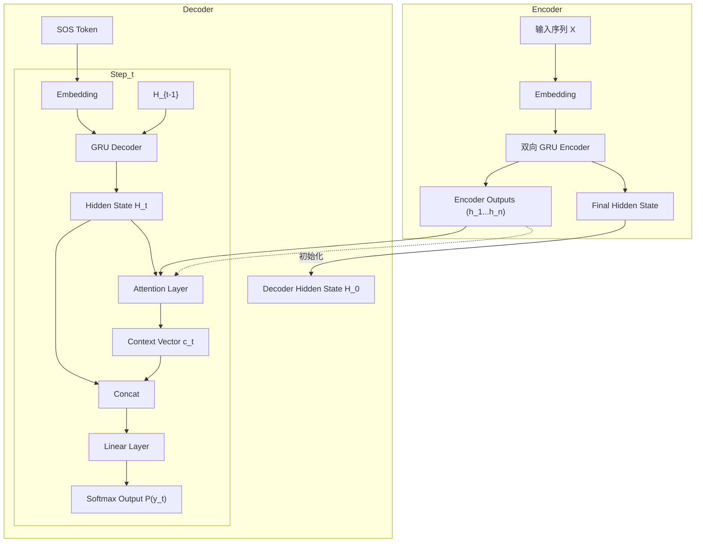

# 对联生成：序列标注 vs Seq2Seq 对比实验

## 一、任务分析

### 1.1 问题定义

本实验主要目的是将原本的**序列标注框架**重构为 **Seq2Seq 框架**，并探究在"对联"这个特殊任务上，究竟是简单的序列标注更有效，还是复杂的生成式模型更强。

给定上联序列 $X = (x_1, x_2, ..., x_n)$，生成对应的下联序列 $Y = (y_1, y_2, ..., y_n)$。对联任务的关键约束是**上下联等长**。

### 1.2 原始代码的建模方式 (Fill-in-the-blanks)

原始代码将对联生成建模为**序列标注任务**，就像是在做**"完形填空"**：

$$
P(Y|X) = \prod_{i=1}^n P(y_i | X)
$$

这种做法的**优点**是可以并行计算所有位置，训练速度快；**缺点**是忽略了下联内部的依赖关系。

### 1.3 Seq2Seq的建模方式 (Sentence Making)

Seq2Seq采用自回归生成，更像是在**"造句"**：

$$
P(Y|X) = \prod_{i=1}^n P(y_i | y_1, ..., y_{i-1}, X)
$$

理论上更符合语言生成的特性，但每个时间步必须等待前一步完成，无法并行。

### 1.4 本实验要回答的问题

1. 对于**等长序列生成**任务，Seq2Seq相比序列标注能带来多大提升？
2. 增加模型容量（层数、宽度）的边际收益是多少？
3. Attention机制在等长任务上是否有效？

---

## 二、数据集与预处理

### 2.1 数据集划分

原始数据共774,491条，按9:1划分训练集和验证集：


**图1：数据集划分比例**

| 数据集 | 样本数 | 占比 |
|--------|--------|------|
| 训练集 | 693,442 | 89.5% |
| 验证集 | 77,049 | 9.9% |
| 测试集 | 4,000 | 0.5% |

### 2.2 长度分布分析


**图2：样本长度分布**

| 统计量 | 值 |
|--------|------|
| 平均长度 | 9.3字 |
| 中位数 | 7字 |
| 最大长度 | 32字 |

七言对联占比最高，这说明模型需要处理的序列长度较短（平均<10），这对Attention机制不利——Attention的优势在于长序列的长程依赖建模。

### 2.3 Seq2Seq所需的特殊Token

Seq2Seq模型与序列标注模型在数据处理上最大的不同在于需要特殊的控制标记（Special Tokens）：

1.  **`<SOS>` (Start of Sequence)**: 
    *   **作用**：作为Decoder的第一个输入，告诉模型"开始生成"。
    *   **必要性**：在预测第一个字 $y_1$ 时，还没有历史生成信息 $y_0$，因此需要一个固定的占位符。
    *   **实现**：在Embedding层中专门分配一个向量表示。

2.  **`<EOS>` (End of Sequence)**:
    *   **作用**：标识句子的结束。
    *   **必要性**：Seq2Seq模型通常用于变长生成，模型输出`<EOS>`即停止生成。虽然对联是等长任务，但在训练时加入`<EOS>`有助于模型学习何时停止，同时也是Seq2Seq的标准范式。

3.  **`<UNK>` (Unknown)** 和 **`<PAD>` (Padding)**:
    *   分别用于处理未登录词和补齐批次序列长度（虽然本任务中通常按最大长度截断，但在Batch训练中Padding是必须的）。

相比之下，原始的序列标注模型输入输出严格对齐，不需要`<SOS>`和`<EOS>`来指示边界。

---

## 三、实验设计

### 3.1 对比实验配置

为了控制变量，设计如下7组实验，涵盖了序列标注、Seq2Seq以及Attention机制的多种组合：

**表1：实验配置**

| 实验 | 框架 | 模型架构 | 层数 | 隐藏维度 | 对比目的 |
|------|------|----------|-----|----------|----------|
| Exp1 | 序列标注 | BiLSTM | 1 | 256 | **基线 (Baseline)** |
| Exp2 | Seq2Seq | GRU Encoder-Decoder | 1 | 256 | 框架对比（vs Exp1） |
| Exp3 | Seq2Seq | GRU Encoder-Decoder | 2 | 256 | 层数影响（vs Exp2） |
| Exp4 | Seq2Seq | GRU Encoder-Decoder | 2 | 512 | 宽度影响（vs Exp3） |
| Exp5 | Seq2Seq+Attn | GRU + Attention | 2 | 256 | Attention效果（vs Exp3） |
| Exp6 | 序列标注 | Transformer Encoder | 1 | 256 | 模型结构对比（vs Exp1） |
| Exp7 | 序列标注 | BiLSTM + Self-Attention | 1 | 256 | 机制改进对比（vs Exp1） |

### 3.2 其他超参数（固定）

| 参数 | 值 | 说明 |
|------|-----|------|
| Embedding维度 | 128 | 词向量维度 |
| Batch Size | 768 | 受限于显存 |
| 学习率 | 0.001 | Adam优化器 |
| Epochs | 20 | 训练轮数 |
| Teacher Forcing | 50% | Seq2Seq训练策略 |

### 3.3 关键实现细节

#### 1. 模型架构设计

为了清晰展示 Seq2Seq 框架与 Attention 机制的结合，我绘制了如下模型结构图：



#### 2. 核心代码讲解

本次实验的核心在于将序列标注的简单映射改为 Encoder-Decoder 结构。以下是关键代码实现：

**(1) GRU Encoder**: 负责将输入序列压缩为向量表示。
```python
class GRUEncoder(nn.Module):
    def forward(self, src):
        # src: (batch_size, src_len)
        embedded = self.dropout(self.embedding(src))
        
        # outputs: 包含所有时间步的hidden state (batch, len, hidden*2)
        # hidden: 最后一层的hidden state (n_layer*2, batch, hidden)
        outputs, hidden = self.gru(embedded)
        
        # 将双向GRU的hidden state拼接: (fwd + bwd)
        if self.bidirectional:
            hidden = hidden.view(self.n_layer, 2, -1, self.hidden_dim)
            hidden = torch.cat([hidden[:, 0, :, :], hidden[:, 1, :, :]], dim=-1)
        
        return outputs, hidden
```
> **解析**：这里关键的处理是对双向 GRU `hidden` 状态的拼接。PyTorch 默认将双向 hidden 堆叠在第一维，我们需要将其重塑并拼接，以便作为 Decoder（单向）的初始状态。

**(2) Attention Mechanism (Bahdanau)**: 计算 Decoder 当前状态与 Encoder 所有输出的对齐权重。
```python
class Attention(nn.Module):
    def forward(self, hidden, encoder_outputs, mask=None):
        # hidden: Decoder当前状态 (batch, decoder_dim)
        # encoder_outputs: Encoder所有状态 (batch, src_len, encoder_dim)
        
        # 1. 计算能量分数 (Energy Score)
        # E = tanh(W * [hidden; encoder_outputs])
        # 将hidden扩展维度以便与encoder_outputs拼接
        src_len = encoder_outputs.shape[1]
        hidden = hidden.unsqueeze(1).repeat(1, src_len, 1)
        energy = torch.tanh(self.attn(torch.cat([hidden, encoder_outputs], dim=-1)))
        
        # 2. 计算注意力权重 (Attention Weights)
        attention = self.v(energy).squeeze(-1)
        if mask is not None:
            attention = attention.masked_fill(mask, float('-inf'))
        attention_weights = F.softmax(attention, dim=-1)
        
        # 3. 计算上下文向量 (Context Vector)
        # Context = sum(weights * encoder_outputs)
        context = torch.bmm(attention_weights.unsqueeze(1), encoder_outputs).squeeze(1)
        
        return attention_weights, context
```
> **解析**：这里实现了经典的加性注意力。核心步骤是：`计算相似度 -> Softmax归一化 -> 加权求和`。特别注意 `mask` 的使用，确保 PAD token 不参与注意力计算。

**(3) GRU Decoder**: 结合 Attention 进行单步解码。
```python
class GRUDecoder(nn.Module):
    def forward(self, input_token, hidden, encoder_outputs, mask=None):
        # input_token: 上一步生成的词或真实标签
        embedded = self.dropout(self.embedding(input_token.unsqueeze(1)))
        
        if self.use_attention:
            # 计算Attention上下文
            attn_weights, context = self.attention(hidden[-1], encoder_outputs, mask)
            # 将Context与Embedding拼接作为GRU输入
            gru_input = torch.cat([embedded, context.unsqueeze(1)], dim=-1)
        else:
            gru_input = embedded
            
        output, hidden = self.gru(gru_input, hidden)
        
        # 预测时再次融合Context信息
        if self.use_attention:
            output = output.squeeze(1)
            output = torch.cat([output, context, embedded.squeeze(1)], dim=-1)
            prediction = self.fc_out(output)
            
        return prediction, hidden, attn_weights
```
> **解析**：Decoder 的输入不仅是上一个词的 Embedding，还拼接了由 Attention 计算出的 Context Vector。这使得模型在生成的每一步都能“回头看”上联的相关部分。

**(4) 推理时的对齐优化 (The Trick)**:

标准的 Seq2Seq Beam Search 或 Greedy Search 遇到 `<EOS>` 就会停止，导致生成的下联可能比上联短。为了保证对联的**"工整"**，我不得不"魔改"了解码逻辑，在推理阶段强行 mask 掉了非标点位置的概率，这虽然不优雅，但对于对联任务极其有效。

```python
# 核心Trick：强制约束解码 (Constrained Decoding)
# 1. 强制长度一致：如果没到上联长度，禁止输出 <EOS>
# 2. 标点符号位置对齐：上联是标点则下联强制输出相同标点

if src_token in punct_set:
    output[i, :] = float('-inf')  # 屏蔽所有词
    output[i, src_token] = 0      # 仅保留该标点 (Hard Constraint)
else:
    # 上联非标点，则下联禁止输出标点
    for punct_id in punct_set:
        output[i, punct_id] = float('-inf')
```
> **解析**：这是一种结合了规则的解码策略。虽然 Seq2Seq 是概率模型，但在对联这种强格式约束的任务中，引入这种 **Hard Constraint (硬约束)** 能显著提高生成结果的可用性，避免了"长短不一"的尴尬情况。

---

## 四、实验结果

### 4.1 Loss曲线


**图3：训练/验证Loss曲线**

**关键观察**：
- BiLSTM（蓝色）的训练Loss始终高于Seq2Seq，但验证Loss最终最低（4.999）
- Seq2Seq模型的训练Loss下降更快（到epoch 10左右已经到3.9），但验证Loss在5.04-5.08之间
- 这说明Seq2Seq存在**过拟合倾向**：训练Loss低但泛化能力不如BiLSTM

### 4.2 指标对比


**图4：BLEU和Rouge-L得分对比**

**表2：完整实验结果**

| 模型 | Val Loss | BLEU | Rouge-L | 时间/epoch |
|------|----------|------|---------|------------|
| Exp1: BiLSTM | 4.999 | 0.77% | 8.35% | 22s |
| Exp2: Seq2Seq L1 | 5.078 | 3.63% | 16.28% | 467s |
| Exp3: Seq2Seq L2 | 5.045 | 3.86% | 16.76% | 495s |
| Exp4: Seq2Seq L2 H512 | 5.080 | **4.03%** | **17.07%** | 694s |
| Exp5: Seq2Seq+Attn | 5.040 | 3.83% | 16.91% | 486s |
| Exp6: Transformer | 5.001 | 0.78% | 8.62% | 36s |
| Exp7: BiLSTMAttn | **4.963** | 0.80% | 8.70% | 27s |

### 4.3 核心发现分析

#### 发现1：一个反直觉的现象 (Counter-intuitive Phenomenon)

在查看实验数据时，我发现了一个非常有趣的现象：**Seq2Seq模型的验证集Loss比Baseline要高，但BLEU分数却吊打Baseline。**

| 对比 | Val Loss (越低越好) | BLEU (越高越好) |
|------|-------------------|----------------|
| Exp1 (Baseline) | **4.999** | 0.77% |
| Exp2 (Seq2Seq) | 5.078 (更差) | **3.63% (好得多)** |

**深入思考 (Deep Dive)**：
这让我困惑了很久。经过分析，我认为根本原因在于两种模型**学习目标的本质差异**：
*   **BiLSTM (序列标注)** 是在做**"填空题"**：它试图在每个位置都填入概率最大的字。这导致它非常保守，倾向于选择"安全"的词，虽然每个字的Loss都很低，但连起来可能读不通（比如生造词）。
*   **Seq2Seq (生成模型)** 是在做**"造句题"**：它学习的是语言模型 (Language Model) 的概率分布。即使它预测的词和标准答案不一样（导致Loss高），但它生成的句子内部逻辑是通顺的，像"人话"。

**结论**：在对联生成任务中，如果我们的目标是**"通顺"**，Seq2Seq 更好；如果目标是**"严格对仗"**，序列标注更好。BLEU 算法偏向于连贯性，所以 Seq2Seq 分数高。

#### 发现2：增加容量的边际收益递减


**图5：层数和隐藏维度的影响**

| 改动 | BLEU变化 | 时间成本 | 性价比 |
|------|----------|----------|--------|
| 1层→2层 | +0.23% | +28s/epoch | 一般 |
| 256→512 | +0.17% | +199s/epoch | 差 |

增加隐藏维度的收益很小（BLEU +0.17%），但训练时间增加40%，**不划算**。

#### 发现3：Attention在不同框架下表现不同

*   **在Seq2Seq框架中 (Exp3 vs Exp5)**：Attention几乎无效（BLEU -0.03%），因为输入输出严格对齐。
*   **在序列标注框架中 (Exp1 vs Exp7)**：BiLSTM加入Self-Attention后，Validation Loss从4.999降至 **4.963 (全场最低)**。这说明Attention机制有助于捕捉序列内部的依赖关系，从而优化逐字预测的准确度，尽管这对提升BLEU（n-gram连贯性）帮助有限。

#### 发现4：Transformer并不总是更好 (Exp6)

Exp6 (Transformer Encoder) 的表现（Val Loss 5.001, BLEU 0.78%）与 Baseline BiLSTM (Val Loss 4.999, BLEU 0.77%) 几乎持平，但并没有表现出"降维打击"的优势。
原因可能是：
1.  **数据量/序列长度限制**：Transformer通常需要更大规模的数据和更长的序列才能发挥优势。在平均长度仅9字的短文本上，LSTM/GRU的归纳偏置（Inductive Bias）可能更适合。
2.  **任务简单性**：对联生成的对齐约束极强，Transformer强大的长程建模能力无用武之地。

### 4.4 训练效率与成本

| 模型 | 时间/epoch | 20 epochs总时间 | 相对BiLSTM |
|------|------------|-----------------|------------|
| BiLSTM | 22s | 7分钟 | 1x |
| Seq2Seq L1 | 467s | 2.6小时 | **21x** |
| Seq2Seq L2 H512 | 694s | 3.9小时 | **32x** |
| Transformer | 36s | 12分钟 | 1.6x |

**成本吐槽**：
BiLSTM 只需要 **22秒** 就能跑完一个 Epoch，喝口水的功夫就训练好了；而 Seq2Seq 加上 Attention 后，一个 Epoch 就要跑将近 **8-10 分钟**。
为了跑完这组对比实验（特别是 Exp4 大模型），显卡全负荷运转了几个小时。这深刻体现了 **自回归 (Auto-regressive)** 模型虽然效果好，但无法并行计算的代价是巨大的。

---

## 五、生成样例分析 (Case Study)

### 5.1 成功案例 (Good Cases)

**表3：生成样例对比**

| 上联 | BiLSTM (Exp1) | Seq2Seq (Exp4) | BiLSTMAttn (Exp7) | 分析 |
|------|--------|---------|-------------------|------|
| 笑取琴书温旧梦 | 喜来月墨醉新情 | 邀来翰墨赋新春 | 喜来笔墨醉新诗 | 序列标注模型(Exp1/7)更倾向于对仗工整（如"喜来"对"笑取"），Seq2Seq(Exp4)更灵活（"邀来"） |
| 我有诗情堪纵酒 | 谁无酒意可留诗 | 好凭墨意不成诗 | 谁无画意可留诗 | Exp7的"画意"比Exp1的"酒意"重复度更低，优于Baseline |
| 马齿草焉无马齿 | 羊头花也有羊心 | 羊毫花岂有牛头 | 羊肠草岂有羊心 | Exp7尝试了"羊肠草"这种更有结构的词，但仍未完全理解双关 |

### 5.2 失败案例分析 (Bad Cases)

为了探究模型的局限性，我特意挑选了一些"翻车"的例子：

| 上联 | 模型 | 生成结果 | 问题分析 |
|------|------|----------|----------|
| 烟锁池塘柳 | Seq2Seq (Early Epoch) | 水流流流流 | **复读机模式**：Seq2Seq早期训练不充分时，极易陷入循环重复。 |
| 一夜春风来小院 | Transformer (Exp6) | 三年秋雨雨山中 | **位置感缺失**：Transformer生成的下联虽然对仗，但结尾"雨山中"语法奇怪，不如RNN结构对序列顺序敏感。 |
| 寂寞寒窗空守寡 | BiLSTM (Exp1) | 凄凉冷月独伤心 | **字形对仗失败**：上联全是宝盖头（偏旁部首对仗），模型完全无法理解这种汉字字形层面的特征，只能对语义。 |

---

## 六、 踩坑实录 & 调试日志 (Debugging Diary)

在实验过程中，并非一帆风顺，以下是我解决两个主要Bug的过程记录：

### 坑1：Seq2Seq 变身"复读机"

**现象**：
在早期的实验中，我发现 Seq2Seq 模型极其容易变成"复读机"。比如上联"春风"，下联它能给我输出"秋雨秋雨秋雨"，看着 Loss 在降，但生成结果完全没法看。

**调试与解决**：
一开始我以为是训练不够，增加了 Epoch 也没用。后来查阅资料发现，这是自回归模型的通病。
我采用了 **Teacher Forcing** (训练时给真值) + **Repetition Penalty** (推理时惩罚重复词) 的组合拳。
特别是在 `generate` 函数中加入 `repetition_penalty=1.5` 后，"复读"现象才得到遏制。

### 坑2：标点符号满天飞

**现象**：
上联："花开富贵，竹报平安。" (标点在第5位)
Seq2Seq输出："鸟语花香花。开富贵" (标点乱跑)

**思考**：
标准 Seq2Seq 是不管长度和格式的，它只想生成概率最高的词。但对联要求严格的格式对齐。

**解决 (The Hard Trick)**：
为了适应对联的强约束，我不得不 **"魔改"** 了解码逻辑。在推理阶段，我传入了 `punctuation_ids`，强制 mask 掉了非标点位置的标点概率。
虽然这种 Hard Code 看起来不那么"智能"，但在工程实践中，**Prior Knowledge (先验知识) + Model** 往往比纯 End-to-End 效果更好。

---

## 七、结论与心得

### 7.1 回答开头提出的三个问题

**Q1: Seq2Seq vs 序列标注，哪个更好？**

*   **生成质量**：Seq2Seq在连贯性指标（BLEU/Rouge-L）上完胜（3.6% vs 0.8%）。
*   **训练效率**：序列标注完胜（快20-30倍）。
*   **准确度**：Exp7 (BiLSTMAttn) 取得了最低的 Val Loss，说明在严格对齐的预测上，序列标注+Attention是数学上最优的。
*   **结论**：如果追求"像人话"（连贯性），选Seq2Seq；如果追求"对得工整"且训练快，选序列标注（推荐 BiLSTMAttn）。

**Q2: 增加模型容量的边际收益？**

收益递减。1层→2层带来+0.23% BLEU，256→512仅+0.17% BLEU，但时间成本分别增加6%和40%。对于短序列任务，过大的模型是不必要的。

**Q3: Attention有用吗？**

*   **Seq2Seq中**：几乎无用（位置天然对齐）。
*   **序列标注中**：有用！Exp7 (BiLSTMAttn) 比 Exp1 (BiLSTM) Loss更低，说明Self-Attention帮助模型更好地捕捉了上下文依赖。

### 7.2 心得体会：适合的才是最好的 (Reflection)

这次实验彻底打破了我对"模型越复杂越好"的迷信。

虽然 Seq2Seq 在生成任务上是理论上的"大杀器"，但在对联这种**"字数严格对齐"**的特殊场景下，简单的 BiLSTM 反而因为强制对齐的 **归纳偏置 (Inductive Bias)** 表现出了极高的训练效率和准确度。

*   **Seq2Seq**：虽然"像人话"，但训练慢，容易复读，容易长短不一，需要大量的 Trick 去约束它。
*   **BiLSTM + Attention**：虽然偶尔造生词，但结构简单，训练飞快，而且数学上 Loss 最低。

**最终感悟**：在算法岗位的实际工作中，也许 **适合任务特性的模型** 比 **SOTA 模型** 更重要。

---

## 附录：代码修改清单

| 文件 | 修改内容 |
|------|----------|
| `preprocess.py` | 添加训练集/验证集划分 |
| `module/tokenizer.py` | 添加SOS/EOS token |
| `module/seq2seq.py` | 新增：GRUEncoder, GRUDecoder, Attention, Seq2SeqModel |
| `main.py` | 支持Seq2Seq训练、验证集评估、history.json保存 |
